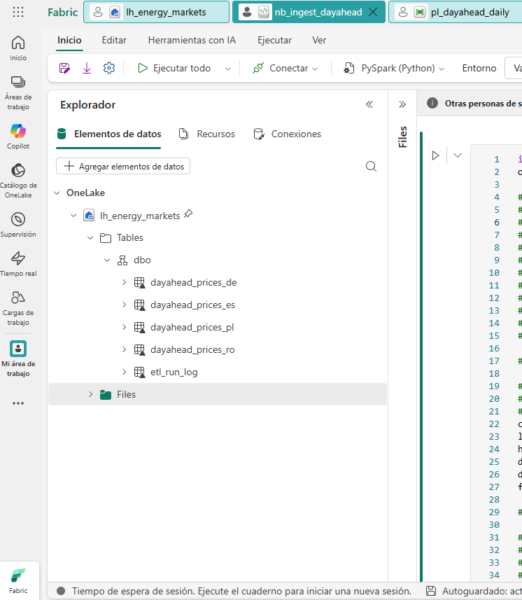
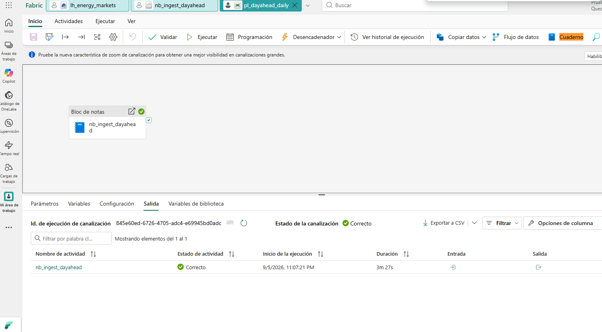
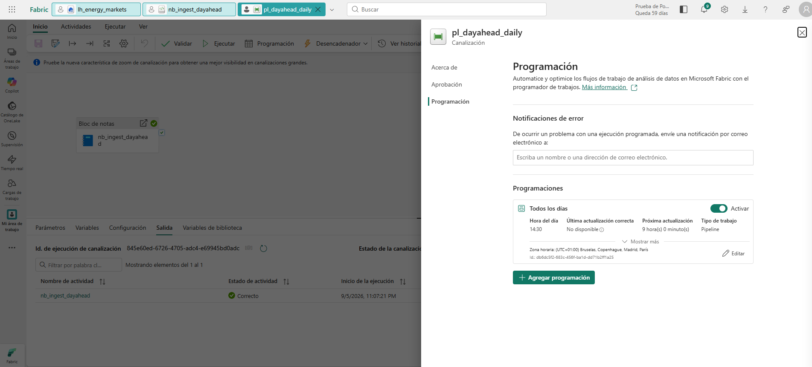

# Precios Day Ahead — ETL multi-país + API + interfaz

Pipeline ETL que ingesta precios *Day Ahead* de **España, Rumanía, Alemania y
Polonia** desde las APIs oficiales de cada mercado, los normaliza a **UTC** y
**EUR/MWh**, los almacena en tablas separadas por país en un Lakehouse de
Microsoft Fabric, y los expone mediante una **API REST securizada** con una
**interfaz web** de comparación.

```
                 ENTSO-E (ES)  ─┐
                 ENTSO-E (RO)  ─┤
                 SMARD   (DE)  ─┼──►  Conectores ──► Normalización ──► MERGE ──►  Lakehouse
                 PSE     (PL)  ─┤     (registry)     UTC · EUR         idempotente   5 tablas
                 BCE (PLN/EUR) ─┘                                                        │
                                                                                         ▼
                                              Interfaz web  ◄── API REST (JWT) ◄── DuckDB / SQL endpoint
```

---

## Índice

- [Puesta en marcha](#puesta-en-marcha)
- [Estructura del repositorio](#estructura-del-repositorio)
- [Fase 1 — ETL](#fase-1--etl)
- [Fase 2 — API REST e interfaz](#fase-2--api-rest-e-interfaz)
- [Despliegue en Fabric](#despliegue-en-fabric)
- [Tests](#tests)
- [Decisiones técnicas](docs/DECISIONES_TECNICAS.md)

---

## Puesta en marcha

Requisitos: **Python 3.11+**.

```bash
git clone <url-del-repositorio>
cd grenergy-dayahead

python -m venv .venv
# Windows
.venv\Scripts\activate
# Linux / macOS
source .venv/bin/activate

pip install -r requirements.txt
cp .env.example .env          # y revisar los valores
```

Variables de entorno (`.env`):

| Variable                    | Descripción                                                  |
|-----------------------------|--------------------------------------------------------------|
| `ENTSOE_SECURITY_TOKEN`     | Token de ENTSO-E. Query parameter en cada llamada.            |
| `DAYAHEAD_DB`               | Ruta del fichero DuckDB local. Por defecto `data/dayahead.duckdb`. |
| `DAYAHEAD_SINK`             | `duckdb` (local) o `delta` (dentro de Fabric).                 |
| `DAYAHEAD_API_KEYS`         | Claves de cliente separadas por coma.                          |
| `DAYAHEAD_JWT_SECRET`       | Secreto de firma HS256. **Cambiar antes de desplegar.**        |
| `DAYAHEAD_JWT_TTL_MINUTES`  | Vida del token. Por defecto 60.                                |
| `DAYAHEAD_CORS_ORIGINS`     | Orígenes permitidos, separados por coma.                       |

### 1. Cargar datos

```bash
# Ventana por defecto: D-2 .. D+1, los cuatro países
python -m dayahead.run

# Rango concreto
python -m dayahead.run --from 2026-08-27 --to 2026-09-06

# Un solo país
python -m dayahead.run --countries PL --from 2026-09-01 --to 2026-09-05
```

Salida real de una ejecución de 11 días:

```json
{
  "window": {"from": "2026-08-27", "to": "2026-09-06"},
  "results": [
    {"country": "ES", "table": "dayahead_prices_es", "rows": 1056, "days_incomplete": [], "missing_points": 0},
    {"country": "RO", "table": "dayahead_prices_ro", "rows": 1056, "days_incomplete": [], "missing_points": 0},
    {"country": "DE", "table": "dayahead_prices_de", "rows":  264, "days_incomplete": [], "missing_points": 0},
    {"country": "PL", "table": "dayahead_prices_pl", "rows": 1056, "days_incomplete": [], "missing_points": 0}
  ],
  "failures": []
}
```

### 2. Levantar API + interfaz

```bash
python serve.py
```

- Interfaz: <http://localhost:8000/>
- Documentación OpenAPI: <http://localhost:8000/docs>
- API key de desarrollo: la que se haya puesto en `DAYAHEAD_API_KEYS`.

---

## Estructura del repositorio

```
config/sources.yaml            Configuración declarativa de países y fuentes
src/dayahead/
  config.py                    Carga del YAML a objetos tipados
  models.py                    Esquema canónico (PricePoint) y clave natural
  http.py                      Cliente HTTP con reintentos y backoff
  fx.py                        Tipo de cambio PLN→EUR (BCE)
  transform.py                 Detección de huecos, deduplicación, DST
  connectors/                  base.py (contrato + registro), entsoe, smard, pse
  sinks/                       duckdb_sink (local), delta_sink (Fabric)
  run.py                       Orquestador CLI
src/api/                       FastAPI: main, security, repository, schemas
web/index.html                 Interfaz de comparación (Chart.js)
fabric/                        Notebook, definición del pipeline y guía de despliegue
tests/                         27 tests sin acceso a red
docs/DECISIONES_TECNICAS.md    Justificación de las decisiones de diseño
```

---

## Fase 1 — ETL

### Fuentes

| País | Fuente | Auth | Formato | Moneda | Granularidad | Particularidad tratada |
|------|--------|------|---------|--------|--------------|------------------------|
| ES | ENTSO-E | Token | XML | EUR | PT15M | Mezcla subastas diaria e intradiarias; curva dispersa |
| RO | ENTSO-E | Token | XML | EUR | PT15M | Mismo endpoint, distinto EIC |
| DE | SMARD | — | JSON | EUR | PT60M | Bloques semanales, no rangos de fecha |
| PL | PSE | — | JSON | PLN | PT15M | Conversión a EUR; el timestamp marca el **fin** del intervalo |

### Esquema de las tablas

Una tabla por país (`dayahead_prices_es`, `_ro`, `_de`, `_pl`), idéntico esquema:

| Columna | Tipo | Descripción |
|---------|------|-------------|
| `country_code` | varchar | ISO-2 |
| `bidding_zone` | varchar | Zona de oferta (código EIC en ENTSO-E) |
| `ts_utc` | timestamp | **Inicio** del intervalo en UTC — clave |
| `ts_local` | timestamp | Mismo instante en hora local del mercado |
| `delivery_date` | date | Día de entrega local (partición) |
| `resolution` | varchar | `PT15M` / `PT60M` |
| `price_original` | double | Precio tal cual lo publica la fuente |
| `currency_original` | varchar | `EUR` / `PLN` |
| `price_eur` | double | Precio normalizado a EUR/MWh |
| `fx_rate` | double | Tipo aplicado (nulo si la fuente ya está en EUR) |
| `source` | varchar | Conector de origen |
| `ingested_at_utc` | timestamp | Trazabilidad de la carga |

Clave natural: `(country_code, ts_utc, resolution)`. La escritura es un `MERGE`
sobre esa clave, así que **cualquier ejecución puede repetirse sin duplicar**.

### Carga incremental sin huecos

- Ventana por defecto **D-2 .. D+1**: el `+1` recoge la subasta del día
  siguiente en cuanto se publica; el `-2` vuelve a pasar por días ya cargados
  para tapar huecos y recoger revisiones de precio.
- Cada ejecución cuenta los puntos recibidos por día y los compara con los
  esperados, **teniendo en cuenta el cambio de hora** (92 puntos el día de 23 h,
  100 el de 25 h). Lo que falta se registra en el log y en `etl_run_log`.
- `--fail-on-gaps` hace que el proceso termine con código 2 si algún día queda
  incompleto, para que el pipeline lo marque como fallido.

Verificado sobre el cambio de hora real del 29/03/2026:

| País | Puntos esperados | Puntos cargados |
|------|------------------|-----------------|
| ES | 92 | 92 |
| RO | 92 | 92 |
| DE | 23 | 23 |
| PL | 92 | 92 |

### Escalabilidad: añadir un país

`config/sources.yaml` es la única fuente de verdad. Para un país que ya cubra
ENTSO-E basta con añadir un bloque:

```yaml
  - code: FR
    name: Francia
    enabled: true
    connector: entsoe
    timezone: Europe/Paris
    resolution: PT60M
    currency: EUR
    table: dayahead_prices_fr
    params:
      base_url: "https://web-api.tp.entsoe.eu/api"
      document_type: A44
      domain: "10YFR-RTE------C"
      contract_market_agreement_type: A01
      security_token_env: ENTSOE_SECURITY_TOKEN
```

No se toca ni una línea del pipeline. Para un proveedor nuevo, se crea una
subclase de `Connector` decorada con `@register("nombre")`; el orquestador la
descubre por el registro.

---

## Fase 2 — API REST e interfaz

### Seguridad

**API key → JWT HS256 de vida corta**, enviado como `Authorization: Bearer`.
La justificación completa está en
[docs/DECISIONES_TECNICAS.md](docs/DECISIONES_TECNICAS.md#5-seguridad-de-la-api);
en resumen: sin estado en servidor, la credencial de larga duración viaja una
sola vez, el token lleva `scope` y expiración, y el mecanismo queda aislado en
`src/api/security.py` para poder sustituirlo por Entra ID sin tocar endpoints.

Se añade además limitación de peticiones (120/min por cliente) y CORS
restringido a los orígenes configurados.

### Endpoints

| Método | Ruta | Auth | Descripción |
|--------|------|------|-------------|
| `GET` | `/health` | — | Estado y países disponibles |
| `POST` | `/auth/token` | API key | Devuelve el JWT |
| `GET` | `/api/v1/countries` | Bearer | Cobertura por país |
| `GET` | `/api/v1/prices` | Bearer | Series de precios |
| `GET` | `/api/v1/stats/daily` | Bearer | Media, mínimo y máximo diarios |

`GET /api/v1/prices` acepta `countries`, `from`, `to` y `granularity`
(`PT15M` / `PT60M`; si se omite, cada país devuelve su resolución nativa).

```bash
TOKEN=$(curl -s -X POST http://localhost:8000/auth/token \
  -H "Content-Type: application/json" \
  -d '{"api_key":"TU_API_KEY"}' | python -c "import sys,json;print(json.load(sys.stdin)['access_token'])")

curl -s -H "Authorization: Bearer $TOKEN" \
  "http://localhost:8000/api/v1/prices?countries=ES,DE&from=2026-09-03&to=2026-09-05&granularity=PT60M"
```

### Interfaz

`web/index.html`, servida por la propia API para evitar CORS en local:

- Gráfica comparativa multi-país con eje temporal en UTC.
- Filtros de fecha y selección de países.
- **Selector de granularidad**: en modo horario, los mercados de 15 minutos se
  promedian para poder compararlos con Alemania, que publica en PT60M. La media
  aritmética es correcta aquí porque todos los intervalos duran lo mismo.
- Tarjetas con media, mínimo, máximo y *spread* entre el país más caro y el más
  barato, y tabla de medias diarias.

---

## Despliegue en Fabric

Guía paso a paso: [fabric/README_FABRIC.md](fabric/README_FABRIC.md).

Resumen: Lakehouse `lh_energy_markets` → subir `src/` y `config/` a `Files/` →
importar `fabric/notebooks/nb_ingest_dayahead.py` → pipeline
`pl_dayahead_daily` programado a las **14:30 CET** (después de la casación de
la subasta y del fixing del BCE).

El notebook **no duplica lógica**: importa el mismo paquete `dayahead` que se
ejecuta y se testea en local. Lo único que cambia entre local y Fabric es el
*sink* (`DuckDBSink` ↔ `DeltaSink`).

### Evidencias del despliegue

Tablas generadas en el Lakehouse `lh_energy_markets` — una por país más la
tabla de traza de ejecuciones:



Ejecución del pipeline `pl_dayahead_daily`, que orquesta el notebook de ingesta:



Programación diaria a las 14:30 CET — después de la casación de la subasta
Day Ahead (13:00 CET) y del fixing PLN/EUR del BCE (14:15 CET):



Cada ejecución registra además una fila en `dbo.etl_run_log` con la ventana
procesada, las filas escritas por país y los días que quedaron incompletos, de
modo que la traza queda en el propio Lakehouse y no solo en estas capturas.

---

## Tests

```bash
pytest
```

27 tests, sin acceso a red (las respuestas de las APIs están simuladas). Cubren
lo que de verdad puede romperse:

- ENTSO-E: descarte de subastas intradiarias, relleno de la curva dispersa,
  recorte fuera de ventana, respuesta `Acknowledgement` sin datos.
- PSE: desplazamiento fin→inicio de intervalo, conversión PLN→EUR, nulos.
- SMARD: selección del bloque semanal correcto, descarte de horas sin publicar.
- Cambio de hora: 92 / 96 / 100 puntos según el día.
- Tipo de cambio: arrastre del último día hábil en fines de semana.
- Escritura: recargar el mismo día actualiza en sitio y no duplica.
- Esquema Delta: `fx_rate` es nulo en ES/RO/DE, y se comprueba que el esquema
  explícito lo admite (los tests de Spark se saltan solos si no hay pyspark).

---

## Limitaciones conocidas

- El *sink* local es DuckDB: suficiente para desarrollo y para la interfaz, pero
  la versión de producción es la Delta de Fabric.
- El rate limiter es en memoria; con varias réplicas habría que moverlo a Redis
  o al API Gateway.
- La conversión PLN→EUR usa el fixing diario del BCE, no un tipo intradiario:
  es la convención habitual para reporting, pero no vale para liquidación.
- Los datos de D+1 solo existen después de la casación (13:00 CET).
